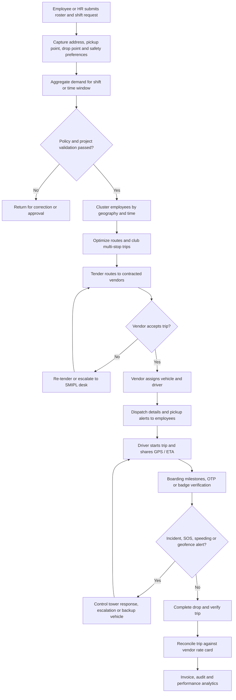

# SMIPL Transport Operations Flow

PeoplePilot is the TMS provider. Select Mobility India Private Limited (SMIPL)
is the transport operator. Bharat Forge and Kirloskar are SMIPL-served client
organisations.

## End-to-end ETMS business flow

1. **Employee rostering and shift management:** Employees or HR submit work
   shifts, office days and roster requests. The system stores home addresses,
   pickup/drop points and safety preferences such as late-night escorts.
2. **Demand aggregation and validation:** Requests are consolidated by shift or
   time window and checked against eligibility, distance, timing and approval
   policies.
3. **Route optimization and clubbing:** Employees are grouped by geography and
   time window. The system creates multi-stop routes that reduce travel time,
   fuel consumption and vehicle count.
4. **Vendor allocation and roster tendering:** Optimized routes are assigned to
   vendors using contracts, rate slabs, availability and performance scores.
   Vendors accept trips and assign vehicles and drivers.
5. **Driver and vehicle dispatch:** Vehicle number, driver identity and phone
   details are published. Employees receive pickup time and vehicle alerts.
6. **Trip execution and real-time tracking:** Drivers record pickup, boarding,
   start and end milestones. GPS provides live location and ETA while SOS,
   panic, speeding and geofence controls monitor safety.
7. **Trip completion and verification:** Employees confirm boarding and drop via
   OTP or badge scan. The final drop time is recorded and the trip is closed.
8. **Billing, audit and analytics:** Completed trips are reconciled against
   vendor rate cards. The system produces invoices and reports OTA, cost per
   employee, fleet utilization and safety compliance.

## Role boundaries

- **PeoplePilot platform admin:** creates and governs tenant workspaces,
  subscriptions, billing, invoices, escalations and audit controls.
- **SMIPL operations/admin:** manages fleets, drivers, employees, routes,
  shifts, requests, allocations, incidents, manifests and reports.
- **Client user:** submits requests, books staff seats on approved trips,
  monitors journeys, reviews staff history and downloads statements.
- **Driver:** accepts assigned trips, starts and closes trips, records boarding,
  confirms safe drop, reports emergencies and logs fuel.

## Minimum data required before allocation

1. Client organisation and service date.
2. Shift and pickup/drop timing.
3. Route and stop sequence.
4. Employee list and boarding stops.
5. Vehicle capacity and driver availability.
6. Escalation contact for operational exceptions.
